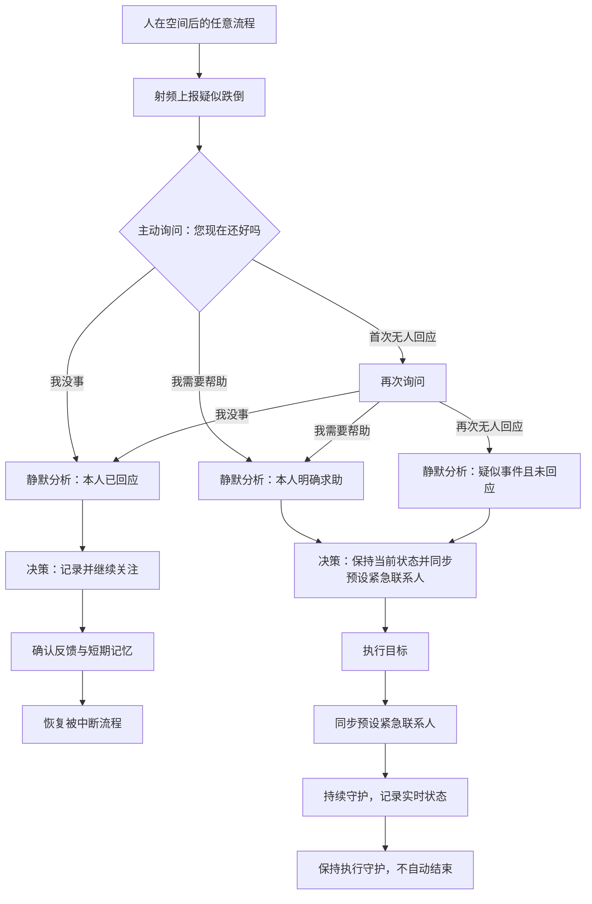

# 疑似跌倒紧急事件体验故事

> 状态：体验故事与首版前端 Mock 已实现；真实检测、语音识别、联系人通知和现场回执待联调。  
> 总体机制：[体验流程与状态](../aios-exhibition-experience.md)。  
> 完整设计规范：[陈展设计系统](../../specs/aios-exhibition-design-system.md)。

## 1. 设计目标

系统已感知到人在空间后，疑似跌倒可在正常、空气异常或人体不适故事的任意运行阶段触发。紧急事件立即取得电视与语音表达优先级，但在本人确认或外部回执前始终表达为“疑似跌倒”，不推断伤情，不给出医学诊断。

推荐主演示：**射频上报疑似跌倒 → 主动询问 → 两次无人回应 → 静默分析与决策 → 同步预设紧急联系人 → 持续记录守护并等待现场介入。**

辅助分支：本人回答“我没事”；本人回答“我需要帮助”。

## 2. 触发条件与证据来源

- 前置条件：INT AIOS 已感知当前空间至少有一人；静默待机阶段禁用“疑似跌倒”。
- Demo 入口：头像浮窗“疑似跌倒”，从感知到人后的任意页面或流程触发。
- 事件来源：首版只使用“射频设备上报疑似跌倒事件” Mock；真实格式、置信度、范围和准确度未核验。
- 空间位置来自当前空间上下文；视频摄像头只提供已确认的基础视觉信息，不作为跌倒或伤情判定来源。
- 确认弹窗不另加证据卡。射频疑似事件、空间、人在场及本人回答／无人回应只在后续思考分析中逐条呈现。

## 3. 全局抢占与视觉连续性

1. 触发时保存原故事、页面阶段、已获得结果和剩余停留时间，暂停原流程自动计时。
2. 已展开的普通语音收合；功能内页让位；紧急确认成为唯一弹窗和唯一活动语音球。
3. 全程保留品牌、Wi-Fi、日期天气、头像与底部主导航，不因进入跌倒故事删除全局框架。
4. 顶部中心继续复用标准 `AiosStatus` 外壳、绿色状态点和既有多状态高亮，不使用红色顶部变体。
5. 只有主动确认弹窗阶段压暗页面；分析、决策、执行和反馈恢复既有过程页 `30%` 遮罩，不叠加紧急黑幕。
6. 红色紧急语义只用于确认弹窗、事件内容卡、相关状态环和语音球；组件形态、圆角、字体、位置和转场继续复用统一设计系统。

## 4. 事件等级变化

| 阶段 | 等级 | 依据 |
| --- | --- | --- |
| 射频上报、尚未确认 | `emergency` | 疑似安全事件需要立即确认 |
| 本人回答“我没事” | `normal` | 只表示本轮确认不需要帮助 |
| 本人请求帮助 | `emergency` | 本人明确求助 |
| 两次询问均无人回应 | `emergency` | 无回应增加介入必要性，但不是跌倒确诊 |
| Mock 通知已发出、等待现场介入 | `emergency` | 不代表联系人确认或现场已接手 |

等级由故事状态传入。不得因按钮点击、圆环走满或通知动作完成自动恢复正常。

## 5. 主流程与三个分支

### 5.1 “我没事”

- 分析：射频出现疑似事件；本人已清晰回应；当前不需要帮助。
- 决策：记录本次疑似事件并继续关注，不发起协同。
- 反馈：本人已回应“我没事”；协同未发起；本轮确认结束。
- 收束：形成短期记忆后恢复原流程；不写“射频误报”。

### 5.2 “我需要帮助”

- 分析：本人明确请求帮助；不追问医学症状，不作诊断。
- 决策：提示保持当前状态、暂不急于起身；持续观察并同步预设紧急联系人。
- 执行：展示执行目标 → 同步预设紧急联系人 → 持续记录守护并等待现场介入。
- 收束：首版无现场回执，页面持续停留执行守护，不进入成功反馈、完成记忆或默认故事。

### 5.3 两次无人回应

- “无人回应”是 Demo 触发按钮，不是体验者语音回答。
- 首次点击模拟当前等待结束，经过确认间 Loading 后再次询问；第二次点击才进入无回应分析。
- 分析只写“疑似跌倒事件后暂未收到本人回应”，不写“已跌倒”“昏迷”或任何医学判断。
- 后续与求助分支共用同一执行闭环：同步预设紧急联系人并持续守护；无需再增加手动“升级协同”步骤。

## 6. 页面主文案与语音

### 6.1 主动确认

- 首次问题与主动语音：`检测到有人可能跌倒了，您现在还好吗？`
- 按钮：`我没事`、`我需要帮助`、`无人回应`。
- 再次询问：`如果您能听到，请回应我。您可以直接说“我没事”或者“我需要帮助”。`
- 两问之间复用统一 Loading 与循环点环，不自动代答。

### 6.2 决策结论与口语告知

| 分支 | 决策结论 | 语音 |
| --- | --- | --- |
| 我没事 | 记录本次疑似事件并继续关注，恢复之前的服务。 | 好的，已确认您目前不需要帮助。我会记录这次疑似事件，并继续关注。 |
| 我需要帮助 | 保持当前状态，请先不要急着起身。我会持续观察，并同步预设紧急联系人。 | 收到。请保持当前状态，先不要急着起身。我会持续观察，并同步预设紧急联系人。 |
| 无人回应 | 暂未收到回应，持续记录现场情况，同步预设紧急联系人并等待现场介入。 | 我暂时没有收到回应。我会持续记录现场情况，并同步预设紧急联系人，等待现场介入。 |

思考／分析阶段不展开语音内容，只保留红色 `thinking` 语音球。决策结论形成后才进入 `responding` 并播报相应语音，播报结束后恢复 `idle`。

### 6.3 执行语音

| Mock 动作 | 语音 |
| --- | --- |
| 开始同步联系人 | 我正在同步预设紧急联系人，并会继续守护现场情况。 |
| 通知动作完成 | 已同步预设紧急联系人。我会继续记录并守护，等待现场介入。 |

“已同步／通知已发出”只表示 Demo Mock 动作完成；不能表达联系人已确认、现场已接手或事件已解决。

## 7. 执行页与长期守护

执行页左侧只保留康养场景加载、主标题和游客身份，不增加协同卡。右侧固定为：

1. `INT AIOS 执行目标`：`保持当前状态，请先不要急着起身。我会持续观察，并同步预设紧急联系人`。
2. `同步紧急联系人`：准备通知 → 正在通知 → `通知已发出，等待现场介入`。完成时红色圆环走满，保留同步图标，不切换为勾。
3. `正在持续守护`：`持续守护，记录实时状态`，红色不定环持续运行。

执行状态收敛为 `pending → initiated → guarding`。同步圆环走满只表示 Mock 通知动作完成；持续守护环不表达救援进度、人员状态或等待时限。求助与无人回应均无限停留执行守护，等待真实外部介入后再定义后续反馈。

## 8. Demo 查验控制

- 跌倒流程中的头像浮窗继续完整展示：重新开始、上一步、下一步，以及空气环境异常、人体检测不舒服、疑似跌倒三个故事入口。
- 上一步／下一步用于逐页查验；只有确认问题尚未回答、页面正在转场、持续守护不得伪造完成等必要逻辑节点禁用。
- 选择其他故事会退出当前跌倒演示并进入所选故事；该操作仅是 Demo 切换，不代表紧急事件已解除。
- 重新选择“疑似跌倒”从首次确认重新演示；重新开始回到默认静默待机。

## 9. 组件复用与实现映射

- 复用 `AiosStatus`、`ConfirmationPanel`、确认间 Loading、`VoiceDock`／`VoicePresence`、`AnalysisPage`、`DecisionPage`、`ExecutionPage`、陪护环、`FeedbackPage` 和全局 `Navigation`。
- `FallEvent.tsx` 只负责编排抢占、确认、分支与 Demo 查验，不创建第二套全局页头、导航或页面组件。
- `fallMock.ts` 维护证据、问题、决策、语音、执行三卡和短期记忆；页面组件不从文字或数值自行推断等级。
- 主动确认沿用统一 `800×480px` 毛玻璃组件，仅由 `severity = emergency` 切换红色表面和语音球。
- Figma `329:69` 提供执行页结构依据；用户后续确认将两个过程卡顺序调整为“同步紧急联系人 → 持续守护”。

## 10. 边界与验收

- 验收覆盖：人在场后任意流程抢占、原计时暂停、完整全局页头与底部导航、标准顶部状态、唯一红色毛玻璃确认弹窗、两次无回应、分析静默、决策语音、执行三卡顺序、联系人圆环走满、持续守护不自动结束、Demo 菜单完整可用。
- “我没事”只形成确认记录，不出现误报、健康诊断、设备成功或协同成功；求助与无人回应不生成成功记忆。
- 真实射频、语音识别、联系人姓名、电话、App、短信、120、真实通知、外部回执、现场接手和医学分析均未接入。

## 11. 当前实现状态

- 5186 Mock 已实现全局抢占、三按钮与两次无人回应、三分支分析／决策、红色毛玻璃确认、联系人同步 Mock、持续守护，以及“我没事”的反馈、短期记忆与原流程恢复。
- 求助与无人回应停留在执行守护；联系人圆环走满后仍保持紧急事件，不自动反馈或结束。
- TypeScript／Vite 构建、固定预览同步及本轮浏览器查验已通过；真实设备与外部协同不在本轮验证范围。
