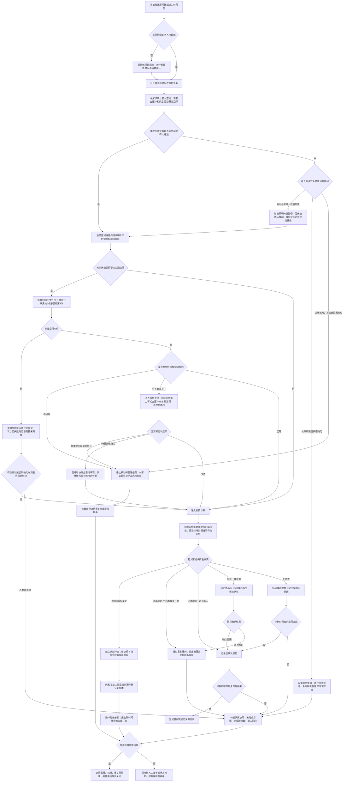

# 晨间血压与服药计划混乱场景规格

## 场景定位

| 项目 | 内容 |
| --- | --- |
| 用户情境 | 老人晨间需要测血压和服药，但会忘记、顺序混乱、测量不规范，或口述已经换药 |
| 主导角色 | AI家庭照护代理与 AI家庭医生协同 |
| 主导能力 | 慢病与用药主动照护 |
| 协同能力 | AI家庭医生 |
| 核心目标 | 按当前有效计划推动测量和服药，并明确区分“提醒过、取过药、确认服下和计划有冲突” |
| 电视依赖 | 体验增强；核心路径由独立语音交互终端完成 |

本场景遵循 [家庭康养共用服务机制](shared-service-mechanisms.md)，尤其是计划版本、测量可信度、健康分流和结果确认机制。

## 成立条件与设备

| 设备或服务 | 本场景提供的事实与动作 |
| --- | --- |
| 引元盒子 | 读取当前有效计划、管理顺序和时间窗、调度设备、记录与升级；本体不拾音、不播报 |
| 独立语音交互终端 | 主动提醒、分步测量引导、接收老人是否服药及换药陈述 |
| 毫米波传感器 | 确认老人当前空间、是否已起床及跨空间移动状态；不能判断测量或服药完成 |
| 智能联动照明 | 老人确认能够安全前往设备空间时开启路径照明；不能证明已安全到达 |
| 智能上臂式血压计 | 上传原始读数、时间和设备错误；不能单独证明测量姿势正确 |
| 智能提醒药盒 | 按药格提醒并记录开盒；开盒不等于服下 |
| 电视 | 在开启时显示大字步骤、读数和当前用药计划 |
| 子女 App、电话服务 | 核对计划冲突、接收漏服或重复服药风险、确认处理结果 |

开通前必须录入并核实每项药物名称、规格、单次剂量、服用时段、与测量或进食的先后关系、漏服处理来源、有效期和确认人。缺少这些字段的药物只能提醒“请核对计划”，不能给出服用指令。

血压计和药盒须登记固定收纳点或最近确认空间。晨间服务开始前先确认老人空间：设备不在同一空间时，仅在老人清醒稳定、行动与平时一致并明确同意后，引导前往固定测量点；开启路径照明并持续确认移动。老人不稳、突然无力或途中不适时立即停止移动并提高风险等级。

## 首期建议规则

| 条件 | 系统处理 |
| --- | --- |
| 进入当前有效计划的晨间时间窗，且检测老人已起床 | 通过当前空间语音终端开始服务；电视开启时同步显示 |
| 计划要求服药前测血压 | 先按共用测量模板完成有效血压，再进入服药；不自行改变医嘱顺序 |
| 计划要求先测量但本次无法取得可信结果 | 仅在有效计划明确允许时继续服药；未说明时暂停相关指令并联系家属或专业人员核实 |
| 首次提醒10分钟未开始 | 再提醒一次并询问“现在不方便、忘了，还是计划有变化” |
| 30分钟仍未完成 | 标记任务未完成并再次询问原因；不连续催促 |
| 到计划时间窗结束仍未完成 | 发起一般家属协同，显示未完成环节和老人回应 |
| 药盒在正确时间开格且老人语音确认已服 | 标记“已确认服药” |
| 只有开盒记录或只有老人语音确认 | 标记“服药待确认”，5分钟后再确认一次 |
| 同一药格重复开启、老人说不确定是否吃过 | 标记“疑似重复服药”，停止继续催服并立即联系家属 |
| 老人说换药、停药、改量或医生改了计划 | 建立计划冲突；不改计划、不建议自行服停，立即请家属或专业人员核实 |
| 有效血压超过个人目标但未命中急症规则 | AI家庭医生解释结果，核对近期活动和计划执行，按规则安排休息与主动复查；不加量、不提前补服 |
| 有效血压命中已审核高风险规则 | 立即转入高风险健康分流；系统不得因单次读数自行改药 |

10分钟、30分钟和计划时间窗均为产品建议参数；具体服药补服方式只能来自该药品说明、医嘱或药师确认。系统不得建议双倍补服。

## 风险等级与空间设备调度

| 等级 | 判断 | 设备调度与处置 |
| --- | --- | --- |
| 正常 | 老人已到固定测量点，血压可信且在计划范围，服药证据完整 | 当前空间语音/电视引导，血压计采集，药盒按计划提示；完成后关闭 |
| 低风险 | 老人稳定但尚未开始、设备不在当前空间或只有单一服药证据 | 可引导安全前往测量点或请在场者递送设备；按10分钟、30分钟规则确认，不连续催促 |
| 中等关注 | 血压超个人目标但无急症信号，或老人对服药状态不确定 | 老人保持坐位，不再跨空间移动；原地复测，处理用药证据冲突并在15分钟复查 |
| 高风险 | 血压命中审核规则，或出现胸闷、严重头晕、突然无力、无法安全移动 | 停止测量和服药推动，不等待再次取设备，转高风险健康分流 |
| 状态未知 | 老人位置、移动能力、血压可信度或服药结果无法确认 | 相关任务保持未完成；停止物理调度，转人工确认或家属协同 |

## 中低风险主动服务

晨间有效血压或脉搏超出个人计划目标、老人可以正常回应且没有急症信号时，任务不得只记录“偏高”后结束：

1. AI家庭医生说明本次采用值和个人目标，询问测量前活动、情绪、睡眠和是否按计划用药。
2. 使用智能上臂式血压计按健康规则指定时间主动复查；首期通用候选为15分钟，个人医疗计划可覆盖。
3. 当前有效用药计划继续正常执行，除非该计划明确规定此时暂停并专业核实；系统不自行增加、减少或提前药量。
4. 复查改善则记录并建立趋势；仍超目标但稳定时形成尽快专业咨询事项；加重或出现症状时立即提高风险等级。

## 完整服务流程

## 反馈、确认与记录

- 老人侧只呈现当前一步；换药冲突时明确说“我先帮您核实，不建议您自己加、减、停或补”。
- 子女侧显示当前有效计划版本、测量原始值与可信度、药盒开格、老人陈述、未完成环节和建议处理入口。
- “已确认服药”需要正确药格开盒与老人确认；家属结构化确认也可作为结果。仅开盒、仅消息送达或系统播报均不能关闭。
- 记录结果分为：全部完成、测量不可信、服药待确认、计划冲突、疑似漏服、疑似重复服药、健康分流中。

## 设备异常与降级

| 异常 | 降级处理和表达 |
| --- | --- |
| 血压计离线或报错 | 明确“本次血压未取得可信结果”；可继续执行不依赖读数且计划明确的事项，不得伪造顺序判断 |
| 药盒离线 | 改用语音逐项确认并标记证据较弱；高风险或老人记忆不清时联系家属 |
| 语音终端不可用 | 电视开启时降级到大字卡和遥控确认；电视关闭时直接通知家属“老人侧提醒与确认能力不可用” |
| 引元盒子不可用 | 场景整体不可用，通知家属改为人工执行计划 |
| 外网不可用 | 本地提醒、设备记录继续；远程核实和升级标记不可用，恢复后核对未完成任务再同步 |

## 首期验收

- 能按有效计划的顺序推动血压与服药，不把固定产品顺序当成医嘱。
- 血压测量能执行休息、两次测量和必要复测，并保存原始值与采用值。
- 血压或脉搏仅超出个人目标且无急症信号时，会执行解释、休息和主动复查，不会直接结束或立即通知家属。
- 血压计或药盒不在同一空间时，只有老人行动稳定且同意才由照明、毫米波和语音终端引导前往；突然无力时直接停止。
- 开盒不会被直接记为已服药；证据不足时进入待确认。
- 换药陈述不会自动改计划；旧、新内容与来源可供家属核实。
- 疑似漏服或重复服药时不提供双倍补服或自行停药建议。
- 时间窗结束仍未完成时，家属能看到具体卡在哪一步。
- 电视关闭时核心路径仍可运行；所有失败和冲突均有结果状态。

## 实施前必须确认

- 首期支持哪些药盒事件：指定药格、开盖次数、药格错开和设备时钟。
- 医疗人员或药师如何审核个人异常阈值、漏服处理和计划来源。
- 语音确认在听力、方言和记忆减退老人中的可用性及替代方式。
- 10分钟、30分钟和各类时间窗的家庭试点校准。

## 简要升级建议

- 接入医院处方、药师审核和复诊计划，减少人工录入。
- 增加可验证取药重量或药板识别，但仍不宣称直接证明吞服。
- 后续如新增其他健康设备，必须先有明确场景、采集模板和用户确认，不直接加入当前方案。

## 医疗安全依据

- [国家卫生健康委《基层医疗卫生机构高血压防治管理标准（WS/T 872—2025）》](https://www.nhc.gov.cn/fzs/c100048/202509/2f3f7cce449145f8b361e70b3ed4ae9a/files/WS%20T%20872%E2%80%942025-20250930105429913.pdf)规定家庭血压测量的准备、时间和复测方法。
- [国家卫生健康委2025年9月22日新闻发布会](https://www.nhc.gov.cn/xcs/c100122/202509/aafe8e99e96947fe96d4bf714d1ca2c7.shtml)明确：漏服处理因药而异，不确定时咨询医生或药师，不能用双倍剂量弥补。
