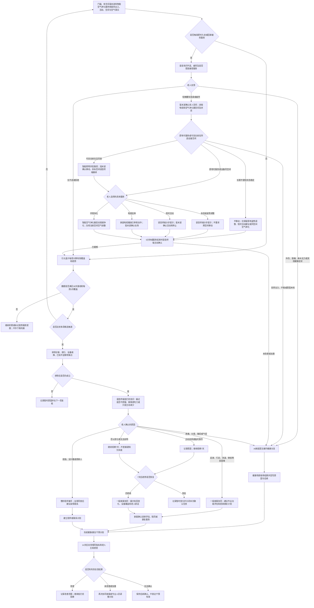

# 连续数周生活能力下降场景规格

## 场景定位

| 项目 | 内容 |
| --- | --- |
| 用户情境 | 老人连续数周减少下楼、做饭、洗澡和社交，仍表示自己可以自理，子女很晚才发现 |
| 主导角色 | AI家庭照护代理 |
| 协同角色 | 出现身体或情绪线索时由 AI家庭医生、居家康复或懂你陪伴能力接手 |
| 主导能力 | 居家康复与日常疗养 |
| 协同能力 | AI家庭医生、懂你陪伴与亲情关怀、老人全天候安全守护 |
| 核心目标 | 用多周事实发现值得确认的变化，理解原因并形成可复查的轻量干预，而不是直接给老人贴“失能”标签 |
| 电视依赖 | 体验增强 |

本场景遵循 [家庭康养共用服务机制](shared-service-mechanisms.md) 的个体规律、多周趋势、健康分流、任务和结果确认机制。

## 成立条件与设备事实

| 设备或服务 | 能确认的事实 | 不能直接推断 |
| --- | --- | --- |
| 多空间毫米波传感器 | 在家活动时长、空间覆盖、房间转换、久坐和离床等 | 是否做饭、洗澡、锻炼或生活能力下降 |
| 门磁 | 开门外出次数、时间和持续时长 | 外出目的、是否社交、是否由他人陪同 |
| 独立语音交互终端 | 老人对变化原因、困难、疼痛和意愿的明确反馈 | 未授权的情绪诊断或持续录音分析 |
| 电视与引元盒子 | 已授权内容使用、康复任务和亲情互动记录；盒子负责趋势计算与调度 | 电视未开不等于情绪低落或缺少社交 |
| 智能联动照明 | 老人同意且能够安全前往电视所在空间时提供路径照明 | 照明成功不等于老人已安全到达 |
| 智能空气净化器 | 提供当前空间颗粒物、运行与滤芯状态并执行净化；杀菌净化和负氧离子仅在在场安全能力已验证时启用 | 环境改善不等于身体问题得到治疗，也不能代表其他房间空气状态 |
| 子女 App | 补充探访、旅行、天气影响、家中访客和真实生活变化 | 不能用家属猜测覆盖老人反馈和设备事实 |

基础闭环至少需要门磁、多空间毫米波、语音终端和28天有效数据。缺少厨房、浴室或社交直接事实时，产品只能表达“外出和家庭活动减少，做饭、洗澡或社交情况待确认”。

## 首期观察维度与触发

每周只计算有稳定设备事实的维度：

- 外出天数、外出次数和总时长；
- 白天有活动的时长、连续久坐时长；
- 家庭空间覆盖和房间转换次数；
- 已确认的康复、做饭、洗澡、陪伴或亲情互动次数。

按共用多周趋势机制运行：至少2个维度下降30%以上且连续2周，或1个关键维度下降50%以上且连续2周，才发起老人确认。单日减少、单一设备变化或老人偶尔不想外出不触发家属警报。

首期默认关键维度为“白天有活动的时长”；只有当前有效康复计划明确指定并有可靠设备事实时，才可替换为该计划绑定的行走或训练维度，开发不得自行把电视使用、社交或做饭推断设为关键维度。

## 同场景的即时中低风险服务

多周趋势用于发现持续下降，久坐疲劳和刚回家腰背不适则走即时服务，不需要等待两周：

| 触发 | 主动服务 |
| --- | --- |
| 毫米波确认连续低活动60分钟，且不在睡眠、进餐、康复或免打扰时段 | 语音询问是否僵硬、疲劳或不舒服；无不适时只建议稍后活动，不通知家属 |
| 老人主动说腰背发紧，或长时间外出回家后10分钟持续低活动且超过个人外出规律 | 排除跌倒、外伤、剧烈疼痛、麻木无力、头晕胸闷后，确认所在空间和行动能力，提供原地姿势调整、短时活动、电视拉伸或同空间空气净化选择 |
| 服务后未改善、加重或出现新症状 | 停止当前服务，转入AI家庭医生；不把动作完成或设备启动作为问题已解决 |

60分钟和10分钟为首期产品建议值，须在老人行动能力、骨关节情况和家庭试点后校准。

## 风险等级与空间设备调度

| 等级 | 判断 | 设备调度与处置 |
| --- | --- | --- |
| 正常 | 活动和空间覆盖在个人规律内，无不适 | 后台记录；空气净化器只维持已授权日常模式 |
| 低风险 | 久坐、轻微腰背发紧、回家疲劳或当前空间空气不佳 | 确认空间和意愿；安全可达时可引导到电视空间，否则提供原地建议或同空间净化，5—10分钟复查 |
| 中等关注 | 不适未改善，或老人表示起身、行走、做饭、洗澡更困难 | 停止舒缓设备；不要求跨空间移动，转AI家庭医生或一般家属协同 |
| 高风险 | 突然无法起身、跌倒、剧痛、麻木无力、头晕胸闷或状态快速加重 | 停止移动和普通设备服务，立即进入健康或安全分流 |
| 状态未知 | 老人空间、活动能力、回应或设备覆盖无法确认 | 不启动净化等增强动作；提高人工确认等级，趋势数据按无效处理 |

## 完整服务流程

## 老人确认与原因分类

首次询问最多覆盖四项：身体是否不舒服、走路起身是否更吃力、做饭洗澡等是否需要帮助、最近是否不想出门或见人。老人说“没事”时不争辩，说明观察到的具体变化并允许其标记特殊原因。

结果原因统一记录为：主动选择、临时事件、设备问题、身体不适、活动能力困难、生活任务困难、情绪或陪伴需要、原因未知。该分类用于服务转接，不是医疗诊断。

## 家属反馈与后续计划

子女收到的是“过去两周外出由每周5天下降到2天、白天活动减少35%，设备覆盖正常；老人表示膝痛且洗澡更吃力”这类可核对事实，不显示“疑似失能”的确定结论。

家属可选择：已知临时原因、将与老人沟通、安排到场、预约专业评估、建立康复计划、暂不介入继续观察。前两项不直接关闭；必须等待7天趋势恢复、现场确认或14天干预复查。

## 设备异常与降级

| 异常 | 降级处理和表达 |
| --- | --- |
| 门磁离线 | 外出维度无效，明确无法判断外出是否减少；不能用在家活动替代 |
| 一个或多个毫米波离线 | 对应空间数据排除；每周覆盖不足5天时暂停趋势判断 |
| 语音终端不可用 | 无法取得老人原因；仅向家属发送“趋势待人工确认”，不得直接定性 |
| 当前空间空气净化器离线、空气读数无效或老人不在覆盖空间 | 不推断环境正常；撤销净化动作和环境判断，不影响其他中低风险服务 |
| 引元盒子离线或历史数据中断 | 重新累计有效基线，不用断档前后数据直接计算下降 |
| 外网不可用 | 本地记录和每周计算继续；家属协同延后并标记未送达，恢复后先核对是否仍需发送 |

## 首期验收

- 基线不足28天或每周覆盖不足5天时，不产生下降判断。
- 单一变化不会触发；候选必须满足多维度或关键维度连续两周规则。
- 系统不会从毫米波直接判断老人没有做饭、洗澡或社交。
- 触发后先询问老人并排除特殊日，再决定是否协同家属。
- 久坐或回家后的轻微腰背不适不等待多周趋势，能完成询问、老人选择、具体服务和服务后确认。
- 老人不具备安全移动能力时不会被引导跨空间使用电视；突然失去移动能力会直接提高风险等级。
- 疼痛、不适、生活任务困难和陪伴需要能转入对应能力，且共享原事件上下文。
- 子女看到基线、变化比例、设备覆盖、老人反馈和不确定内容。
- 干预后14天有复查；没有复查不会表达已经改善。
- 设备断档后重新积累基线，不制造假下降。

## 实施前必须确认

- 各毫米波和门磁能够稳定输出的最小事实，以及空间部署验收标准。
- 30%、50%、连续2周和每周5天覆盖的家庭试点校准。
- 哪些生活事件可由接入设备可靠证明，哪些必须通过老人或家属确认。
- 专业功能评估、居家康复、陪伴和家属协同的服务入口与授权边界。

## 简要升级建议

- 接入智能按摩背垫，增加经确认的低强度、限时舒缓动作卡和服务后复查。
- 接入经授权的厨房家电智能插座、浴室用水传感器或出行数据，提高生活事实覆盖。
- 由专业人员远程使用标准化日常生活活动能力量表，不由系统自动打分。
- 将天气、短期疾病和家庭探访纳入可核实的特殊日，进一步减少误扰。

## 专业评估依据

- [国家卫生健康委《关于开展老年护理需求评估和规范服务工作的通知》](https://www.nhc.gov.cn/yzygj/c100068/201908/01a2813f59bc44a0aaab11f0f9fda3f7.shtml)要求从日常生活活动、精神与社会参与、感知觉与沟通等方面开展老年护理需求评估；本产品只发现变化线索，正式能力判断应由专业评估完成。
