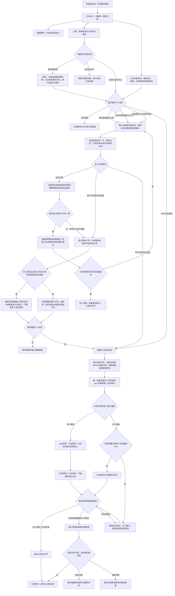

# 夜间起身后卫生间无回应场景规格

## 场景定位

| 项目 | 内容 |
| --- | --- |
| 用户情境 | 独居或夜间缺少持续照护的老人，起身进入卫生间后长时间未回床且没有回应 |
| 主导角色 | AI家庭照护代理 |
| 协同角色 | 老人表示身体不适时，由 AI家庭医生接手 |
| 主导能力 | 老人全天候安全守护 |
| 核心目标 | 自动发现异常、现场确认、联系可接手的人并持续跟踪到结果明确 |
| 电视依赖 | 不依赖电视 |

本场景遵循 [家庭康养共用服务机制](shared-service-mechanisms.md)。本文只定义本场景设备、参数、流程、降级和验收。

## 成立条件与设备

| 设备或服务 | 本场景提供的事实与动作 |
| --- | --- |
| 卧室毫米波传感器 | 离床、回床及卧室活动 |
| 卫生间毫米波传感器 | 进入、停留、活动、持续静止和疑似跌倒 |
| 门磁 | 是否发生开门外出；不能单独证明老人位置 |
| 智能联动照明 | 离床后开启卧室至卫生间路径灯 |
| 引元盒子 | 本地汇总、计时判断、任务管理和设备调度；本体不拾音、不播报 |
| 独立语音交互终端 | 配置在主要活动空间，由引元主动播报、远场接收老人回应并支持双向通话 |
| 卫生间 SOS 或防潮语音对讲终端 | 老人主动求助；主要语音终端无法覆盖卫生间关门状态时，防潮语音对讲终端成为必配 |
| 智能上臂式血压计、智能电子体温计 | 不作为本场景成立条件；老人回应不适后，只有设备同空间或由到场者递送时才由AI家庭医生调用 |
| 子女 App、电话和短信服务 | 联系家属、反馈处理进度和确认结果 |

开通场景前必须完成空间与设备对应、夜间时段、隐私授权和至少两名联系人配置；应尽量配置可到场资源。还必须在卫生间关门、老人正常说话音量下验证播报可听清、回应可拾取；未通过时增加卫生间防潮语音对讲终端。没有最终可到场资源时，须向家庭明确服务只覆盖发现与通知。

## 首期建议规则

以下时间为首期产品建议值，设备联调和家庭试用后校准：

| 条件 | 系统处理 |
| --- | --- |
| 默认夜间22:00—06:00检测到离床 | 立即打开路径灯，只记录，不询问、不通知家属 |
| 卫生间报告疑似跌倒并持续静止10秒 | 立即语音确认 |
| 进入卫生间超过15分钟仍未离开 | 语音确认 |
| 离床超过20分钟未回床 | 门磁在线且显示外出时转入外出场景；门磁在线且无外出或门磁离线时均语音确认，离线时同时表达位置无法确认 |
| 老人按下 SOS | 不等待其他条件，立即语音回应并进入紧急协同 |

个人规律形成后，卫生间停留条件可调整为“个人正常时长上限＋5分钟”，但不得晚于离床20分钟的固定安全上限。

单一设备报告疑似跌倒，只能表达“检测到疑似跌倒，需要确认”，不能表达老人已经跌倒。

## 风险等级与空间设备调度

| 等级 | 判断 | 设备调度与处置 |
| --- | --- | --- |
| 正常 | 正常离床、进入卫生间并按规律回床 | 按实际路径开启照明，毫米波确认回床后关闭；不询问、不通知 |
| 低风险 | 停留超时但老人清楚回应、活动能力正常 | 调度覆盖当前空间的语音终端询问；保持当前空间和返程路径照明，观察5分钟 |
| 中等关注 | 老人回应不适、需要帮助或无法按平时方式返回 | 不引导跨空间移动；AI家庭医生接手，血压计或体温计只有同空间或由他人送达时才使用 |
| 高风险 | SOS、疑似跌倒后无回应、突然无法起身或状态加重 | 停止移动引导；调度当前空间语音/SOS并立即联系第一与备用联系人，不等待健康设备 |
| 状态未知 | 门磁、空间毫米波或语音事实冲突，无法确认老人位置与能力 | 依次使用可能空间的语音终端确认；仍未知即进入紧急协同，不盲目启动非路径设备 |

## 完整服务流程

## 各端反馈与确认

### 老人侧

- 正常回应后，独立语音交互终端询问是否需要帮助，引元盒子再通过后续活动或回床信号验证。
- 表示不适或无法起身时，自动切换 AI家庭医生，不要求老人重新描述已说过的信息。
- SOS 触发后，即使老人随后取消，也必须再次语音确认；高风险时结合设备事实后才能关闭。

### 子女侧

高优先协同事项必须显示：离床时间、可能空间、持续时长、设备事实、询问次数、老人回应、已经执行的照明和联系动作，以及当前“不确定”的内容。

子女通过 App 反馈“已收到、正在联系、正在到场、已安排他人、已确认安全、仍需帮助或继续升级”。只有结构化结果确认可以关闭任务；聊天或语音反馈必须再次确认。

## 结果与后续记录

| 结果 | 判定与后续 |
| --- | --- |
| 正常起夜 | 检测到正常回床，记录后结束，不通知家属 |
| 老人确认正常 | 老人明确回应且5分钟内恢复活动或回床，关闭并记录是否误扰 |
| 有人接手 | 联系人确认正在处理，任务继续保持，等待最终结果 |
| 已解决 | 老人、授权家属或服务人员提供有效确认，记录处理结果后关闭 |
| 状态未知 | 老人无回应且无人确认现场状态，任务持续重试和升级 |
| 身体不适 | 转入 AI家庭医生或后续健康服务，保留本次安全事件关联 |
| 设备问题 | 创建设备检查事项；修复前持续显示本场景服务受限 |

进入人工协同、身体不适或疑似跌倒分支的事件，关闭后默认生成次日状态确认；优先使用后台活动事实验证，仍有异常时再询问老人或通知家属。

## 设备异常与降级

| 异常 | 降级处理和表达 |
| --- | --- |
| 门磁离线或故障 | 明确反馈“门磁设备离线或故障，当前无法通过门状态判断老人是否外出，老人位置无法确认”；继续使用离床和卫生间事实，但不得表达确定位置 |
| 卫生间毫米波离线 | 使用离床20分钟未回床规则；不能表达老人位于卫生间、持续静止或疑似跌倒 |
| 卧室毫米波离线 | 无法可靠创建离床事件，本场景标记服务受限并通知家属检查 |
| 覆盖当前空间的语音终端离线、拾音或播报故障 | 达到异常条件后跳过现场语音确认，直接进入家属协同；明确提示现场语音确认能力不可用 |
| 引元盒子离线或故障 | 无法完成本场景判断和设备调度，场景整体标记服务不可用并立即通知家属 |
| 智能照明不可用 | 不阻断感知和协同；记录夜间照明辅助失败并通知检查 |
| 外部网络不可用 | 家庭局域网正常时，本地感知、照明、语音终端和记录继续；远程联系标记不可用，恢复后补传，不能表达已完成家属协同 |

## 首期验收

- 正常起夜并回床，不询问老人、不通知家属。
- 达到任一介入条件后，引元盒子调度独立语音交互终端按两次20秒规则主动确认。
- 单一疑似跌倒信号不会被表达为确定跌倒。
- 老人正常回应后，还会用5分钟活动或回床事实验证。
- SOS 或两次询问无回应后，第一和备用联系人同时收到 App 警报和自动电话。
- 联系人仅确认收到或正在处理时，任务不会关闭。
- 门磁离线时出现明确设备故障和位置未知表达。
- 老人可安全返回时由照明、毫米波和目标空间语音终端接续；突然无法起身或能力未知时停止移动并升级。
- 联系人均未响应时，任务保持状态未知并按共用机制继续升级。
- 电视关闭、子女未打开 App 时，本地核心路径仍能运行。
- 所有关闭事件均保留触发、执行、联系、确认、结果和后续记录。

## 实施前必须确认

- 毫米波设备能否稳定提供离床、空间存在、持续静止和疑似跌倒事实。
- 独立语音交互终端能否被引元主动播报、连续接收本轮回应、报告在线状态，并在目标空间满足老人音量和远场拾音要求。
- 卫生间关门状态的现场声学验收是否通过；未通过时采用哪类防潮语音对讲终端。
- App 持续警报、自动电话和短信能力的服务接入方式。
- 家属无人响应后的最终可到场资源及其授权边界。
- 断网备用通信和断电保障是否进入首期。
- 10秒、15分钟、20分钟、60秒等建议值的设备联调和真实家庭验证计划。

## 简要升级建议

- 授权视频终端辅助现场复核。
- 移动网络和备用供电增强紧急联系连续性。
- 智能门锁支持授权到场人员入户。
- 接入社区、物业、照护机构或服务中心，补齐无人接手时的处置闭环。
