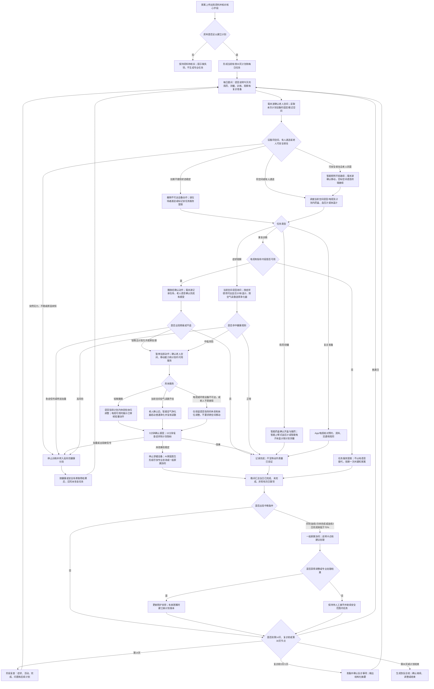

# 出院后30天居家恢复场景规格

## 场景定位

| 项目 | 内容 |
| --- | --- |
| 用户情境 | 老人出院或术后回家，前几天有人照料，随后用药、训练、观察和复诊逐渐中断 |
| 主导角色 | AI家庭照护代理与 AI家庭医生协同 |
| 主导能力 | 居家康复与日常疗养 |
| 协同能力 | 慢病与用药主动照护、AI家庭医生、老人全天候安全守护 |
| 核心目标 | 把院内计划转成每天可执行、可确认、可升级的家庭任务，连续推动至30天总结或专业计划结束 |
| 电视依赖 | 康复动作指导必须使用；其余任务可降级到语音 |

本场景遵循 [家庭康养共用服务机制](shared-service-mechanisms.md) 的计划版本、照护任务、健康分流、联系人和结果确认机制。

## 成立条件与设备

| 设备或服务 | 本场景提供的事实与动作 |
| --- | --- |
| 引元盒子 | 拆分30天计划、调度每日任务、汇总完成度和异常；本体不拾音、不播报 |
| 独立语音交互终端 | 日程说明、任务提醒、症状询问、服药与训练后确认 |
| 家庭电视 | 展示经确认的康复动作、注意事项、阶段进度和复诊准备 |
| 毫米波传感器 | 在场、起居活动、久坐和训练时段活动线索；不能判断动作是否标准 |
| 智能联动照明 | 老人确认能够安全前往设备或训练空间时开启路径照明；不能证明已安全到达 |
| 智能上臂式血压计、智能电子体温计 | 按出院计划提供血压与脉搏、体温事实；不要求每位老人每天完成无关测量 |
| 智能提醒药盒 | 提供开盒事实并配合老人确认服药；开盒不等于服下 |
| 智能空气净化器（按计划使用） | 只用于当前空间空气改善，不处理疼痛或健康异常 |
| 子女 App | 上传出院资料、核对计划、处理遗漏、查看每日与阶段摘要 |

开通必须取得出院小结、当前用药清单、康复或护理计划、活动禁忌、需观察信号、复诊日期和医疗联系人。缺失核心资料时只建立“资料待核实”，不得自动生成疾病或术式特异的训练和用药计划。

## 30天运行节奏

| 阶段 | 固定服务 |
| --- | --- |
| 回家当天至24小时 | 家属逐项核对资料、药物、设备、联系人、禁忌和复诊；生成当前有效计划 |
| 第1—7天 | 每日晨间说明、逐项任务、晚间结果汇总；遗漏当日处理；异常按健康规则升级 |
| 第8—14天 | 保持每日任务；第14天完成阶段复查，比较症状、活动和完成情况 |
| 第15—21天 | 继续有效计划，可合并稳定任务的说明和反馈；不得跳过或自行减少医嘱任务 |
| 第22—30天 | 准备复诊资料；第30天生成完成、未完成、异常和待续计划摘要 |

复诊前3天检查预约、资料、交通和陪同；前1天再次确认。若专业计划短于或长于30天，以有效计划日期为准，30天只是本产品首期服务包的总结节点。

## 首期建议规则

| 条件 | 系统处理 |
| --- | --- |
| 单个低风险任务首次错过 | 在任务允许时间窗内10分钟后重试一次，并询问不做原因 |
| 同一任务连续2次未完成 | 发起一般家属协同，检查疼痛、理解困难、设备问题或计划不适配 |
| 连续2天当日计划完成率低于70% | 生成“恢复计划正在中断”事项；要求家属调整照护安排或联系专业人员 |
| 老人说计划、药物或训练已改变 | 建立计划冲突，只限制相关项，等待来源核实 |
| 训练中出现明显疼痛、头晕、胸闷、呼吸困难或跌倒 | 立即停止当次训练并转入突发不适或安全场景 |
| 测量轻度超出个人目标但没有急症信号 | 执行对应中等健康关注动作卡，主动复查；首次不直接通知家属 |
| 训练后仅有轻微酸胀，且当前计划允许居家处理 | 停止继续训练，执行计划内休息、体位调整或非术区舒缓，15分钟后复查 |
| 观察项命中经审核健康规则 | AI家庭医生分流，不等待当日汇总 |
| 电视不可用且任务依赖动作画面 | 不用纯语音替代动作教学；改期一次并通知家属修复或提供现场指导 |

70%是首期识别“整体计划正在失去推动”的产品建议阈值，不代表医疗依从性结论；上线前应按任务风险和真实家庭试点校准。

当日计划完成率＝已有效确认完成的到期任务数÷当日可执行的到期任务数。待核实、已暂停、尚未到时间和因设备故障无法执行的任务不进入分母，但必须单独列入晚间汇总，不能借排除项掩盖服务中断。

## 风险等级与空间设备调度

| 等级 | 判断 | 设备调度与处置 |
| --- | --- | --- |
| 正常 | 当日任务按计划进行，老人活动与反馈稳定 | 先确认老人空间，再调度当前空间语音/电视及计划内血压计、体温计或药盒 |
| 低风险 | 首次错过任务、轻微非术区酸胀或当前空间空气不佳 | 轻微酸胀时执行计划内休息、体位调整或电视指导的轻量动作；空气不佳时调度同空间空气净化器；服务后复查 |
| 中等关注 | 血压或体温偏离个人计划、症状持续但无急症信号 | 保持安全体位，不要求跨空间取设备；原地复测或由他人递送，15分钟复查并准备专业咨询 |
| 高风险 | 跌倒、急症信号、明显加重或突然失去行动能力 | 停止训练和移动引导，不等待设备，转高风险健康或安全场景 |
| 状态未知 | 位置、能力、测量、训练结果或设备服务无法确认 | 相关任务保持未完成，停止非必要物理设备调度并提高人工确认等级 |

## 完整服务流程

## 任务确认与阶段结果

| 任务 | 有效确认 |
| --- | --- |
| 用药 | 正确药格开盒与老人确认，或授权家属/服务人员确认 |
| 健康测量 | 完成对应可信采集模板并取得采用值 |
| 康复训练 | 指导内容完整播放、老人在场、老人确认完成和感受；只证明参与，不证明动作标准 |
| 症状观察 | 老人明确反馈或在场人员确认；设备事实作为补充 |
| 复诊准备 | 家属确认预约、陪同、交通和资料；复诊完成需家属或专业服务回传结果 |

第14天和第30天摘要必须分别列出：计划版本、完成率、连续遗漏、健康异常、服务受限、家属处理、老人主观感受和下一阶段待确认事项。

## 设备异常与降级

| 异常 | 降级处理和表达 |
| --- | --- |
| 电视不可用 | 非视觉任务转语音；动作训练暂停或改期，明确缺少安全的视觉指导 |
| 毫米波离线 | 不能验证在场或活动变化；训练仅记录老人自报，趋势能力受限 |
| 药盒、血压计或体温计离线、位置未知或不可达 | 只暂停受影响任务并点名缺失事实；不能把提醒当完成，也不能让无关恢复任务整体停止 |
| 当前空间空气净化器不可用 | 撤销环境动作，改用不依赖设备的计划内服务；不影响轻微酸胀处置和健康风险分流 |
| 语音终端不可用 | 电视可用时改大字卡和遥控确认；否则通知家属老人侧任务推动能力受限 |
| 引元盒子不可用 | 整体计划调度不可用，立即向家属提供当日人工清单 |
| 外网不可用 | 本地任务继续并暂存；远程资料核实、专业咨询和家属协同标记不可用 |

## 首期验收

- 没有完整出院资料时不会自行生成疾病特异计划。
- 每项任务都能显示来源、有效版本、时间窗、执行结果和未完成原因。
- 训练视频播放或人在场不会被直接判断为动作正确。
- 轻微酸胀或指标偏离会获得计划内服务和15分钟复查，不会在排除高风险后直接结束。
- 每位老人只调用出院计划需要的具体健康设备，不默认每天测量全部指标。
- 老人不能安全前往设备空间时不会被要求移动；系统会降级设备服务或按突然失能原因升级风险。
- 电视不可用时不会用纯语音代替必须看动作的训练。
- 连续遗漏和整体完成率下降能形成具体家属协同，不只是日报提醒。
- 新医嘱进入新版本，历史计划和已执行记录不被覆盖。
- 健康或安全异常切换场景后，结果会回写原恢复计划。
- 第14天、复诊前和第30天能产出可供家庭或专业人员使用的摘要。

## 实施前必须确认

- 首期支持的出院资料格式、人工核对责任和专业内容审核方。
- 哪些训练必须电视、哪些允许音频提示、哪些必须专业人员现场或视频参与。
- 不同任务的风险等级、允许重试次数和遗漏升级规则。
- 医疗机构、互联网医院或护理服务的接入与结果回传方式。

## 简要升级建议

- 接入智能按摩背垫，补充非术区、低强度、限时舒缓动作卡和服务后复查。
- 接入医院出院计划与复诊系统，减少资料抄录和版本冲突。
- 在明确授权下使用视频或动作传感辅助姿态评估，并由专业人员审核。
- 提供居家护理、康复师和上门服务的预约与结果回传闭环。

## 专业服务依据

- [国家卫生健康委《进一步改善护理服务行动计划（2023—2025年）》](https://www.nhc.gov.cn/yzygj/c100068/202306/8fe28be0f8e241cb8444b4f242706495.shtml)提出通过信息化手段为出院患者提供在线咨询、护理随访和居家护理指导等延续性护理服务。
