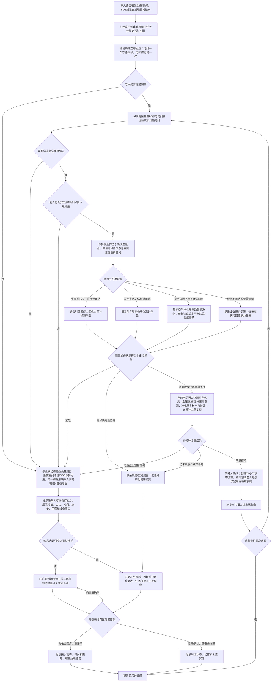

# 独自在家突发头晕或胸闷场景规格

## 场景定位

| 项目 | 内容 |
| --- | --- |
| 用户情境 | 老人独自在家突然头晕、胸闷或明显不舒服，想先忍一忍，异地子女无法判断严重程度 |
| 主导角色 | AI家庭医生 |
| 协同角色 | AI家庭照护代理负责现场安全、设备调度和家属协同 |
| 主导能力 | AI家庭医生 |
| 协同能力 | 老人全天候安全守护、慢病与用药主动照护 |
| 核心目标 | 快速取得关键事实，给出明确下一步，并持续跟踪到症状解除或有人、专业服务接手 |
| 电视依赖 | 不依赖电视 |

本场景遵循 [家庭康养共用服务机制](shared-service-mechanisms.md) 的健康风险分流、联系人升级、确认关闭和设备降级规则。

## 成立条件与设备

| 设备或服务 | 本场景提供的事实与动作 |
| --- | --- |
| 独立语音交互终端 | 接收老人主动表达或 SOS 后对话，询问关键症状并支持与家属通话 |
| 引元盒子 | 汇总健康背景、当前对话、设备事实，执行已审核规则包和任务闭环；本体不拾音、不播报 |
| 毫米波传感器 | 当前空间、活动、持续静止和疑似跌倒线索；不能判断疾病 |
| SOS 设备 | 老人主动请求立即帮助 |
| 智能上臂式血压计 | 在老人安全、愿意且能正确操作时提供血压和脉搏，用于头晕、心慌后的规范测量 |
| 智能电子体温计 | 老人感觉发冷、发热或感染迹象时提供体温事实 |
| 智能空气净化器（增强） | 提供当前空间颗粒物、运行与滤芯状态并执行净化；杀菌净化和负氧离子仅在在场安全能力已验证时启用，不能替代医疗处理 |
| 子女 App、自动电话 | 同步事实、建议行动、接手进度和最终结果 |

开通前必须核实家庭地址、既往病史、过敏史、当前用药、第一与备用联系人及可到场资源。医疗规则包未完成专业审核时，只能提供一般安全提示和人工协同，不能自动分为低风险。

## 首期建议规则

### 直接进入紧急协同

出现任一项不等待补齐健康数据：

- 老人无回应、意识不清、突然倒地或无法站立；
- 新发或明显加重的胸痛、胸闷、胸口压迫感、严重呼吸困难；
- 胸部不适伴大汗、恶心呕吐、明显心悸或晕厥；
- 突发口角歪斜、言语不清、单侧肢体无力或活动不协调；
- 老人明确说“很严重、快不行了”或按下 SOS。

系统同时联系第一与备用联系人，明确提示“请根据现场情况尽快拨打120”；首期不自动代拨120。

### 可先现场确认的中等健康关注

仅当老人持续清醒、能完整回应、没有上述信号且能安全坐下或躺下时：

1. 60秒内问清开始时间、是否加重、是否胸部不适或严重呼吸困难、是否跌倒、言语和单侧肢体是否异常、是否漏服或重复服药。
2. 头晕或心慌优先使用智能上臂式血压计；感觉发冷发热时使用智能电子体温计。设备不在同一空间时，不要求不适老人自行前往或取用；可由在场者递送，否则标记测量受限。
3. 引导保持坐位或卧位；当前空间空气读数不佳时，可在老人确认后启动智能空气净化器普通净化模式。杀菌净化或负氧离子只有设备已验证可在老人所在空间安全运行时才可选择，环境改善不等于症状解除。
4. 15分钟主动复查症状和相关指标。加重或出现新信号立即升级；未改善转尽快专业咨询；缓解后建立24小时内状态复查，是否通知家属按个人计划和老人意愿执行。

15分钟是产品安全观察建议值；疾病特异性条件和指标阈值由经审核规则包覆盖。

## 风险等级与空间设备调度

| 等级 | 判断 | 设备调度与处置 |
| --- | --- | --- |
| 低风险 | 只有当前空间空气不佳或轻微不适，老人清醒、稳定且无急症信号 | 原地休息；确认后启动同空间空气净化器普通模式，5分钟确认感受和空气读数 |
| 中等关注 | 轻微头晕、心慌、发冷发热，能完整回应且能安全坐卧 | 不跨空间移动；同空间或他人递送后使用血压计/体温计，15分钟复查 |
| 尽快专业咨询 | 一次复查仍未缓解、指标持续偏离或设备无法取得关键事实 | 形成结构化摘要并联系家属或专业服务；空气净化器不能替代该升级 |
| 高风险 | 无回应、急症信号、突然无法起身或快速加重 | 停止普通设备服务，不等待测量，立即紧急协同 |
| 状态未知 | 空间、回应能力、移动能力或测量结果无法确认 | 不按低风险处理；停止非必要物理调度并提高人工确认等级 |

## 完整服务流程

## 各端反馈与确认

- 老人侧先说行动，不展开疾病解释；紧急时使用“我正在联系家人，请保持坐下或躺下，不要独自走动”。
- 子女侧必须显示：症状原话、开始时间、回应能力、急症信号、有无跌倒、测量原始值及可信度、当前位置线索、已采取动作、家庭地址和建议下一步。
- 联系人点击“已收到”不等于接手；需继续选择正在通话、正在到场、已联系120、已由医疗人员接手或现场已处理。
- 关闭必须有症状复查、到场确认或专业接手结果；“老人后来有活动”不能单独证明健康风险解除。

## 结果与后续记录

| 结果 | 后续 |
| --- | --- |
| 症状缓解 | 24小时内复查，保留是否复发和是否需要门诊咨询 |
| 家属或到场人员接手 | 继续等待现场结果，不因接手动作关闭 |
| 120或医疗人员接手 | 记录接手时间、就医去向和可获得的处置摘要，转入后续健康任务 |
| 状态未知 | 持续联系与升级，不表达老人安全 |
| 疑似漏服、重复服药或计划冲突 | 关联晨间或用药任务，由专业人员核实，不现场给出补服建议 |

## 设备异常与降级

| 异常 | 降级处理和表达 |
| --- | --- |
| 语音终端离线或对话失败 | 有异常线索时直接进入紧急协同，说明无法现场询问老人 |
| 血压计或体温计离线、报错、不在当前空间或老人无法操作 | 点名说明缺失的指标；按症状和回应能力继续分流，不得因缺一台设备延后紧急协同 |
| 当前空间空气净化器离线或空气读数无效 | 撤销环境净化动作和环境判断；不影响健康风险分流，不把其他房间空气读数用于当前空间 |
| 毫米波离线 | 不能表达老人空间、活动或跌倒状态；语音和 SOS 路径继续 |
| 引元盒子离线 | 场景不可用，使用仍可用的 SOS/对讲直连联系人；立即通知家属系统能力受限 |
| 外网不可用 | 本地语音、SOS和记录继续；远程协同不可用时通过可用蜂窝对讲或本地声光提醒，明确尚未联系到家属 |

## 首期验收

- 老人无回应或命中任一急症信号时，不等待测量，直接紧急协同。
- 首次健康询问在60秒内只收集影响下一步的关键事实。
- 头晕老人不会被要求独自移动取设备。
- 血压计或体温计不可用、不可达时不会导致流程停住或被判定正常。
- 系统会按症状选择具体设备，不要求不适老人跨空间取设备；空气改善不会单独排除急症。
- 观察分支一定在15分钟主动复查；未缓解或加重会升级。
- 子女能直接看到家庭地址、症状时间线、已知事实、不确定内容和建议动作。
- 有人点击接收后任务仍保持处理中，直到现场或专业结果确认。

## 实施前必须确认

- 经执业医生审核的急症规则包、慢病个体阈值、适用人群和版本发布流程。
- 语音识别对“胸闷、喘不上气、半边没劲”等老人日常表达的测试词集。
- 家庭地址、门禁、既往史和用药摘要的90天复核机制。
- 是否配置蜂窝通信、专业坐席或签约医生，补齐外网中断和家属无人接手路径。

## 简要升级建议

- 接入签约医生、互联网医院或护理坐席，实现结构化资料直接转交。
- 经授权接入120或本地急救平台，并增加位置与门禁信息核验。
- 增强专业坐席对多次家庭测量的远程解读，但不得替代症状优先的安全分流。

## 医疗安全依据

- [北京市政府120急救提示](https://www.beijing.gov.cn/fuwu/bmfw/sy/jrts/202607/t20260713_4759730.html)与[北京120急救科普](https://wjw.beijing.gov.cn/bmfw_20143/jkzs/jzjj/202312/t20231204_3489868.html)均将意识异常、胸痛胸闷、呼吸困难、突发言语或肢体异常等列为应重视并及时就医、必要时拨打120的信号。
